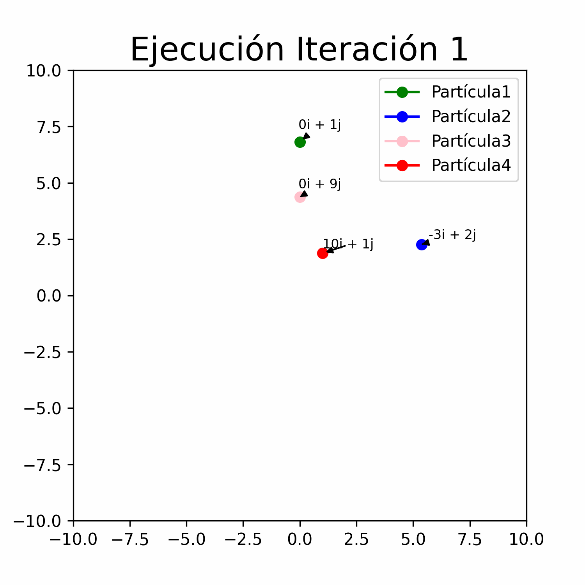
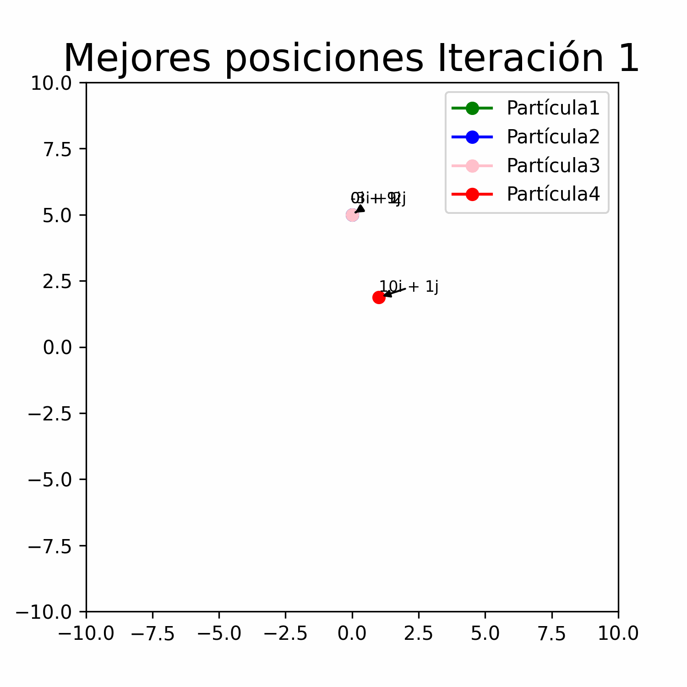

# Tarea 4 CI-5652

## Pregunta 1
La solución a la pregunta 1 se encuentra en el archivo travel.py

## Pregunta 3
La solución a la pregunta 3 se encuentra en el archivo particles.py

Cambios de posición de las partículas durante las 10 iteraciones

Cambios de la mejor posición encontrada para las partículas en las 10 iteraciones

